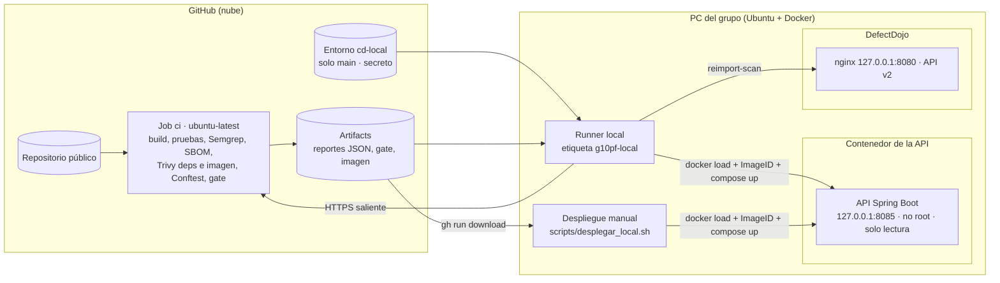

# Ajustes del modelo de amenazas por la implementación final

El modelo del trabajo 1 (Caso 5, Aplicación Bancaria Móvil, 41 amenazas STRIDE) se mantiene sin cambios. Este documento señala los ajustes que introduce la implementación final:

1. cómo se corresponden los elementos del DFD original con la API Spring Boot de este repositorio y con sus vulnerabilidades reales;
2. qué amenazas nuevas aparecen por los componentes que agrega la solución (GitHub Actions, artifacts, runner local, contenedor y DefectDojo), con su mitigación y la evidencia que la demuestra.

## 1. Correspondencia entre el DFD y la implementación

| Elemento del DFD (Caso 5) | Implementación en este repositorio | Límite de confianza |
|---|---|---|
| App Móvil Bancaria / Cliente | Cualquier consumidor HTTP de la API (navegador, `curl`, otra aplicación) | Fuera del sistema |
| API Gateway / Servidor API | API Spring Boot (3.5.14 en la línea base; 4.0.8 con Spring Framework 7.0.9 tras la remediación) (`ProductController`, `CommentController`, `AdminController`) en un contenedor publicado solo en `127.0.0.1:8085` | Contenedor en la PC del grupo |
| Servicio de Autenticación | `AuthController` + `SecurityConfig` (Spring Security) | Dentro del contenedor |
| BD Clientes y Credenciales / BD Cuentas y Transacciones | Base H2 en memoria (`schema.sql`, `data.sql`) | Dentro del contenedor |
| Logs de auditoría | Logs de la aplicación (SLF4J/Logback, salida estándar del contenedor) | Dentro del contenedor |
| Core Bancario, Red interbancaria, Proveedor SMS/Push | No existen en la API de laboratorio | — |

### Vulnerabilidades del código base frente al modelo

| Vulnerabilidad del código base | Archivo | Elemento del DFD | STRIDE | Amenaza del modelo relacionada | Control que la detecta |
|---|---|---|---|---|---|
| Inyección SQL por concatenación del parámetro `name` | `ProductController.java:24-25` | API → BD Clientes | Tampering / Information disclosure | T38 (inyección SQL), T21 (filtración de la base) | Semgrep (`tainted-sql-string`, `spring-sqli` y regla propia `lab-java-sql-concatenation`) |
| XSS reflejado en la vista previa de comentarios | `CommentController.java:19` | API Gateway / Servidor API | Tampering | T11 (datos expuestos en respuestas) | Semgrep (`tainted-html-string` y `lab-html-without-output-encoding`) |
| Contraseña del administrador y secreto JWT en el código | `AuthController.java:18-19` | Servicio de Autenticación | Spoofing / Information disclosure | T12 (JWT falsificados), T21 | Semgrep (`lab-hardcoded-secret`) |
| La contraseña se escribe en el log | `AuthController.java:26` | Logs de auditoría | Information disclosure | T30 (datos sensibles en logs) | Semgrep (`lab-sensitive-data-in-log`) |
| `anyRequest().permitAll()`: todos los endpoints, incluido `/api/admin/**`, son públicos | `SecurityConfig.java:16` | Servicio de Autenticación | Elevation of privilege | T06 (autorización solo en el cliente), T14 (BOLA/IDOR) | Semgrep (`lab-permit-all`) |
| CSRF desactivado | `SecurityConfig.java:15` | Servicio de Autenticación | Tampering | T10 (alteración de solicitudes) | Semgrep (`lab-csrf-disabled`) |
| Actuator expuesto (`exposure.include=*`, `env.show-values=always`), errores con stacktrace y consola H2 accesible | `application.properties` | API Gateway / Servidor API | Information disclosure | T15 (mensajes de error detallados) | Ninguno de los controles lo detecta: Semgrep solo analiza `src/main/java` y no hay DAST. Se corrige por revisión manual |
| Clave de API ficticia en la configuración | `application.properties:19` | API Gateway / Servidor API | Information disclosure | T21 | Ninguno (mismo motivo); se corrige por revisión manual |
| `commons-text` 1.9 (CVE-2022-42889, Text4Shell) y librerías de Spring, Tomcat y Jackson con CVE | `pom.xml` | API Gateway / Servidor API | Elevation of privilege / Denial of service | T13, T25 | SCA: SBOM CycloneDX + Trivy, y Trivy sobre la imagen |
| Imagen de ejecución con JDK completo, sin digest y `HEALTHCHECK` con `curl` (inexistente en Alpine) | `Dockerfile` | Contenedor | Tampering / Denial of service | — (componente nuevo) | Conftest (Policy as Code) y Trivy sobre la imagen |

## 2. Amenazas de los componentes nuevos

La solución agrega componentes que el Caso 5 no tenía. Se identifican con el prefijo `TN-` (amenaza nueva) para no confundirlas con las T01–T41 del modelo original.

| ID | Componente | Amenaza | STRIDE | Mitigación | Evidencia verificable |
|---|---|---|---|---|---|
| TN-01 | GitHub Actions (acciones de terceros) | Una acción comprometida o un tag movido ejecuta código malicioso en el pipeline | Tampering | Acciones referenciadas por SHA de 40 caracteres; el repositorio solo permite acciones de GitHub y exige fijación por SHA; imágenes de herramientas por versión y digest | `devsecops.yml` (`uses: …@<sha>`), `gh api repos/FidelRada/pf-devsecops-grupo10/actions/permissions` |
| TN-02 | Artifacts del run | Se despliega una imagen distinta de la que se escaneó (artifact manipulado o reemplazado) | Tampering | La imagen se exporta en el mismo run que la escanea; antes de desplegar se compara el ID de la imagen cargada con `Metadata.ImageID` del reporte de Trivy y la etiqueta con `ArtifactName` | Step "Cargar imagen y comprobar que es la escaneada" del job `cd-local` y `scripts/desplegar_local.sh` |
| TN-03 | Runner local (self-hosted) | Un pull request desde un fork ejecuta código en la PC del grupo | Elevation of privilege | Aprobación obligatoria de workflows de colaboradores externos; los jobs locales solo corren en `push`/`workflow_dispatch` sobre `main`; entorno `cd-local` restringido a `main`; el runner se enciende solo durante las ejecuciones y nunca como servicio; nunca se aprueban runs de forks; los integrantes entran con rol Read o Triage (sin escritura no pueden lanzar `workflow_dispatch` con un workflow modificado) | `gh api …/actions/permissions/fork-pr-contributor-approval`, `gh api …/environments/cd-local`, jobs locales *skipped* en el run del PR |
| TN-04 | Runner local | El usuario del runner pertenece al grupo `docker`, lo que equivale a privilegios de administrador en la PC | Elevation of privilege | Riesgo residual aceptado y declarado: etiqueta exclusiva del runner, credenciales del runner con permisos 600, ventanas de ejecución cortas | `stat -c %a` de los archivos de credenciales del runner |
| TN-05 | DefectDojo (API key) | Fuga de la API key en el repositorio o en los logs del run | Information disclosure | La clave vive solo en el secreto `DEFECTDOJO_API_KEY` del entorno `cd-local`; el importador nunca la imprime y GitHub la enmascara | `gh api …/environments/cd-local/secrets`, pruebas de `tests/test_importar_defectdojo.py` |
| TN-06 | DefectDojo | La instancia queda expuesta en la red local y alguien consulta o altera los hallazgos | Information disclosure / Spoofing | nginx de DefectDojo publicado solo en `127.0.0.1:8080`; contraseñas generadas al azar fuera del repositorio | `ss -ltn` muestra `127.0.0.1:8080` |
| TN-07 | Contenedor de la aplicación | Un fallo de la API permite escalar en el host | Elevation of privilege | Usuario no root, sistema de archivos de solo lectura, `cap_drop: ALL`, `no-new-privileges`, puerto solo en `127.0.0.1` | `deploy/compose.yml`, `docker inspect` del contenedor desplegado |
| TN-08 | DefectDojo / runner | Si DefectDojo no responde, una versión se desplegaría sin que sus hallazgos queden registrados | Denial of service | `cd-local` depende de que el job `defectdojo` termine bien; si falla, no se despliega y el run se relanza con `workflow_dispatch` | Condición `needs` del job `cd-local` |
| TN-09 | Repositorio | Cambios en `main` sin revisión ni trazabilidad | Repudiation | `main` protegida: PR obligatorio y check `ci` requerido; cada importación en DefectDojo guarda el run, el commit y la rama | `gh api …/branches/main/protection`, campos `build_id` y `commit_hash` del Engagement |

## 3. Arquitectura implementada

Los límites de confianza nuevos son: GitHub (código y artifacts), la PC del grupo (runner y Docker), el contenedor de la aplicación y la instancia de DefectDojo. El runner solo abre conexiones salientes hacia GitHub; ningún servicio de la PC queda expuesto fuera de `127.0.0.1`.
